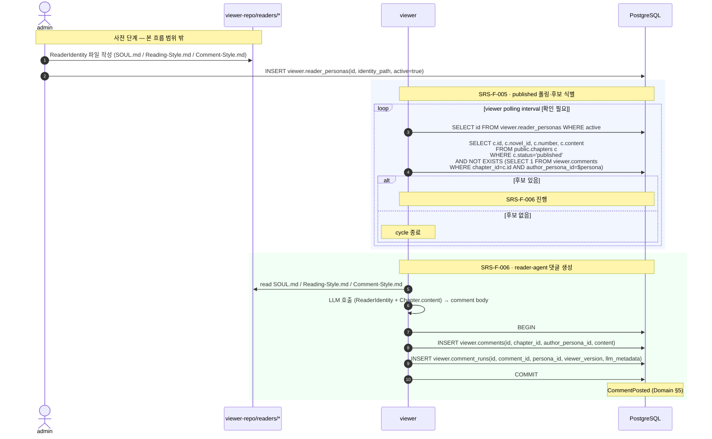

# Flow `FLOW-AI-READER-COMMENT` — AI 독자가 published 회차에 댓글을 다는 한 줄기

## 1. 시나리오 명

`Chapter.status='published'` 인 회차 1건이 등록된 active ReaderPersona들에게 읽히고, 각 페르소나가 자신의 정체성(SOUL · 읽기 스타일 · 댓글 스타일)을 따라 댓글 1건씩을 남기는 흐름. 한 (Chapter, ReaderPersona) 쌍에 대해 댓글은 1건만 생성된다 (Domain §4.9).

본 흐름은 SRS-F-005 ~ SRS-F-006을 시각화하며, walking skeleton 1단계(`FLOW-CHAPTER-LIFECYCLE`)의 종착 상태 `published`가 본 2단계의 입력이 됨을 보여준다.

---

## 2. 참여자

| 참여자 | 역할 | 비고 |
|---|---|---|
| `admin` (사람) | ReaderPersona 시드·활성 토글, ReaderIdentity 파일 작성 | 본 흐름의 트리거만 제공, 흐름 내부 동작은 범위 밖 |
| `viewer-repo/readers/*` (파일 시스템) | ReaderIdentity 단일 진실 (SOUL.md · Reading-Style.md · Comment-Style.md) | viewer가 읽기 전용 (Data §6.2) |
| `viewer` (서비스) | published 폴링, reader-agent 댓글 생성, viewer.* 쓰기 | MOD-VIEWER |
| `PostgreSQL` | 단일 진실 저장소. `public.chapters` 읽기 + `viewer.*` 쓰기 | Data §5 권한 분리 |

`generator` / `pd` 는 본 흐름의 외부 — 그들이 생성한 `Chapter.status='published'` 가 입력일 뿐 시퀀스에 등장하지 않는다 (`FLOW-CHAPTER-LIFECYCLE` 참조).

서비스 간 직접 HTTP 호출은 Phase 1에서 없다. 모든 통신은 PostgreSQL 상태(`public.chapters.status='published'` + `viewer.comments`)와 파일 시스템(ReaderIdentity) 을 매개로 한다.

---

## 3. 시퀀스

정상 경로(댓글 생성)와 분기 경로(LLM 실패 / 동시성 충돌)를 한 다이어그램에 표현.

---

## 4. 분기 / 실패 경로

### 4.1 LLM 호출 실패 (viewer)
- viewer의 LLM 호출이 실패하면 해당 `(persona, chapter)` 조합에 대해 `viewer.comments` 와 `viewer.comment_runs` 어느 쪽에도 row를 만들지 않는다.
- 실패 메타를 별도 보관할지 (예: `viewer.comment_runs` 에 `comment_id IS NULL` 실패 row, 또는 별도 실패 로그 테이블) 정책은 `[확인 필요]`.
- 다음 폴링 cycle에서 같은 `(persona, chapter)` 가 다시 후보로 식별되어 재시도된다.

### 4.2 정체성 파일 누락
- `viewer.reader_personas.identity_path` 가 가리키는 디렉토리 또는 필수 파일(SOUL.md / Reading-Style.md / Comment-Style.md) 중 하나라도 부재 시 해당 페르소나의 댓글 생성을 skip 하고 로그를 남긴다.
- 다른 페르소나는 영향 없이 진행. cycle 종료 시점에 skip 건수 집계.
- 사람이 파일을 보강하면 다음 cycle에서 자동 복귀.

### 4.3 동시성 충돌 (두 viewer 인스턴스)
- 두 viewer 인스턴스가 같은 `(persona, chapter)` 후보를 동시에 잡아 양쪽 다 INSERT를 시도하면 `comments_one_per_persona_per_chapter` 부분 유니크 인덱스(Data §1, Domain §4.9)가 두 번째 INSERT를 거부한다.
- 두 번째 인스턴스는 같은 트랜잭션 내 다른 작업도 함께 롤백 (`viewer.comment_runs` 도 미생성).
- 명시적 행 락 도입 여부는 `[확인 필요]` — 현재는 자연 직렬화로 충분.

### 4.4 published가 아닌 회차에 INSERT 시도
- Domain §4.8 위반. `viewer.comments.chapter_id` 가 `Chapter.status='published'` 가 아닌 회차를 가리키면 INSERT가 거부된다 (트리거 또는 애플리케이션 — `[확인 필요]`).
- 정상 경로에서는 SRS-F-005의 폴링 쿼리가 `WHERE c.status='published'` 조건을 두므로 이 경로가 일반적으로 발생하지 않는다. 회차가 (정의되지 않은 경로로) `published`에서 다른 상태로 되돌아간 직후의 race 케이스에 한해 발생 가능.

### 4.5 부분 실패 (트랜잭션)
- SRS-F-006의 `viewer.comments` INSERT와 `viewer.comment_runs` INSERT 는 동일 트랜잭션. 둘 중 하나가 실패하면 모두 롤백되며 해당 `(persona, chapter)` 는 다음 cycle에서 재시도된다.
