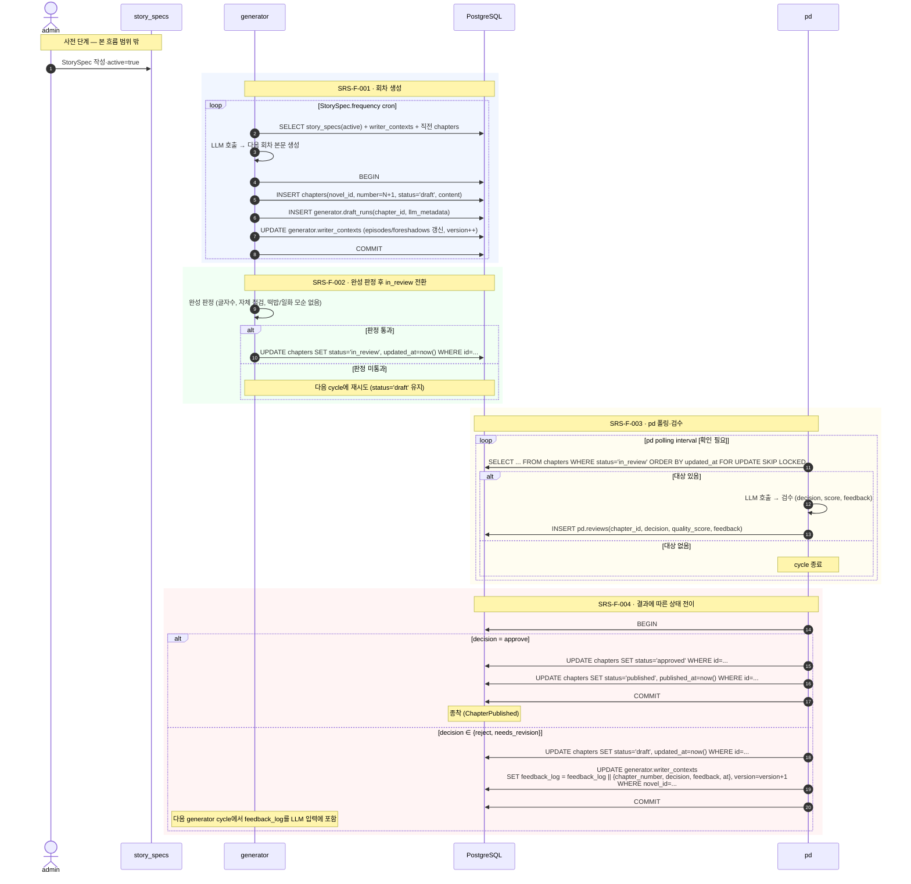

# Flow `FLOW-CHAPTER-LIFECYCLE` — 회차 1건의 일생

## 1. 시나리오 명

회차 1건이 generator에서 생성되어 pd 검수를 거쳐 `published` 종착에 이르거나, `reject`/`needs_revision` 판정으로 `draft` 상태에 다시 들어가 재시도되는 한 회차의 전체 일생.

본 흐름은 SRS-F-001 ~ SRS-F-004를 시각화하며, Domain Model §4.1 상태기계의 실 운용 흐름을 보여준다.

---

## 2. 참여자

| 참여자 | 역할 | 비고 |
|---|---|---|
| `admin` (사람) | StorySpec 작성·활성화 | 본 흐름의 트리거만 제공, 흐름 내부 동작은 범위 밖 |
| `generator` (서비스) | 회차 생성, 완성 판정, draft→in_review 전이 | MOD-GENERATOR |
| `PostgreSQL` | 단일 진실 저장소. 모든 상태 보관 | `public.*`, `generator.*`, `pd.*` 스키마 (Data §5) |
| `pd` (서비스) | in_review 폴링, 검수, approve→published 또는 reject→draft 전이 | MOD-PD |

서비스 간 직접 HTTP 호출은 Phase 1에서 없다. 모든 통신은 PostgreSQL 상태(Chapter.status, pd.reviews, writer_contexts.feedback_log)를 매개로 한다.

---

## 3. 시퀀스

정상 경로(approve)와 분기 경로(reject/needs_revision)를 한 다이어그램에 표현.

---

## 4. 분기 / 실패 경로

### 4.1 LLM 호출 실패 (generator)
- generator의 LLM 호출이 실패하면 chapter row를 만들지 않는다.
- `generator.draft_runs`에 실패 메타만 남길지 여부는 `[확인 필요]` (실패 로그를 별도 테이블로 분리할지 정책 결정 필요).
- 같은 Novel에 대해 `status ∈ {draft, in_review}` row가 없다는 §Domain 4.3 불변식이 유지된다.
- 다음 cycle에 자동 재시도.

### 4.2 완성 판정 미통과 (generator)
- Chapter는 `status='draft'`로 잔류.
- 다음 cycle에 generator가 같은 row를 보고 본문을 보완할지, 새로 생성할지의 정책은 `[확인 필요]` (재생성/보완 모드).
- §Domain 4.3 불변식은 그대로 유지(여전히 draft 1개).

### 4.3 LLM 호출 실패 (pd)
- `pd.reviews` row를 생성하지 않는다.
- Chapter는 `status='in_review'`로 잔류.
- 락(SKIP LOCKED)이 풀리면 다음 폴링 cycle에서 다시 pick up.

### 4.4 reject / needs_revision
- §SRS-F-004에 따라 Chapter.status가 `draft`로 되돌아가고 `writer_contexts.feedback_log`에 feedback이 누적된다(동일 트랜잭션).
- 다음 generator cycle에서 generator는 누적 feedback을 LLM 입력에 포함시켜 재생성한다 (Domain §4.6).
- `feedback_log`의 보관 기간/엔트리 최대치 정책은 `[확인 필요]`.

### 4.5 동시성 충돌
- 두 generator 인스턴스가 동시에 같은 Novel의 다음 회차를 만들려 하면 `chapters_one_active_per_novel` 부분 유니크 인덱스가 두 번째 INSERT를 거부한다 (Data §4.1).
- 두 pd 인스턴스가 동시에 같은 in_review row를 잡으려 하면 `FOR UPDATE SKIP LOCKED`가 한쪽만 통과시킨다.
- writer_contexts 동시 갱신은 `version` 비교로 한쪽이 재시도하게 된다.

### 4.6 부분 실패 (트랜잭션)
- SRS-F-004의 reject 처리에서 `chapters.status` 변경과 `writer_contexts.feedback_log` 누적은 동일 트랜잭션 안에서 일어난다. 둘 중 하나가 실패하면 모두 롤백되며 Chapter는 `in_review`로 남는다 (다음 pd cycle에서 재시도).
