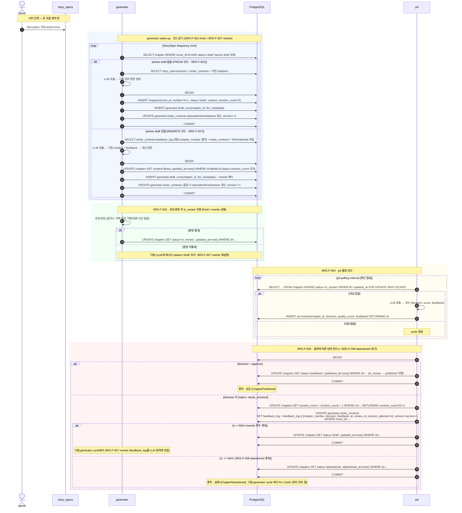

# Flow `FLOW-CHAPTER-LIFECYCLE` — 회차 1건의 일생

## 1. 시나리오 명

회차 1건이 generator 에서 생성되어 pd 검수를 거쳐 `published` 로 성공 종착하거나, `reject`/`needs_revision` 판정으로 `draft` 로 복귀해 generator 가 본문을 **재작성(rewrite)** 하며 루프를 돌고, 누적 `revision_count` 가 MAX 에 도달하면 `abandoned` 로 실패 종착하는 한 회차의 전체 일생.

본 흐름은 SRS-F-001 ~ SRS-F-004 + SRS-F-007 + SRS-F-008 을 시각화하며, Domain Model §4.1 상태기계 + §4.10 재시도 상한의 실 운용 흐름을 보여준다.

---

## 2. 참여자

| 참여자 | 역할 | 비고 |
|---|---|---|
| `admin` (사람) | StorySpec 작성·활성화 | 본 흐름의 트리거만 제공, 흐름 내부 동작은 범위 밖 |
| `generator` (서비스) | 회차 fresh 생성 (SRS-F-001) / draft rewrite (SRS-F-007), 완성 판정, draft→in_review 전이 (SRS-F-002) | MOD-GENERATOR |
| `PostgreSQL` | 단일 진실 저장소. 모든 상태 보관 | `public.*`, `generator.*`, `pd.*` 스키마 (Data §5) |
| `pd` (서비스) | in_review 폴링·검수 (SRS-F-003), approve→published 직행 / reject→draft 또는 reject→abandoned 분기 (SRS-F-004 + SRS-F-008) | MOD-PD |

서비스 간 직접 HTTP 호출은 Phase 1에서 없다. 모든 통신은 PostgreSQL 상태(Chapter.status, pd.reviews, writer_contexts.feedback_log)를 매개로 한다.

---

## 3. 시퀀스

정상 경로(approve)와 분기 경로(reject/needs_revision)를 한 다이어그램에 표현.

---

## 4. 분기 / 실패 경로

### 4.1 LLM 호출 실패 (generator)
- generator의 LLM 호출이 실패하면 chapter row 를 만들거나 갱신하지 않는다 (fresh 모드는 INSERT 안 함, rewrite 모드는 기존 content 보존).
- `generator.draft_runs`에 실패 메타만 남길지 여부는 `[확인 필요]` (실패 로그를 별도 테이블로 분리할지 정책 결정 필요).
- 같은 Novel에 대해 `status ∈ {draft, in_review}` row 가 최대 1개라는 §Domain 4.3 불변식이 유지된다.
- 다음 cycle에 자동 재시도. rewrite 실패의 경우 `revision_count` 가 변하지 않으므로 MAX 도달 위험도 늘지 않는다.

### 4.2 완성 판정 미통과 (generator)
- Chapter는 `status='draft'`로 잔류.
- 다음 cycle에 generator는 active draft 가 있음을 보고 **SRS-F-007 rewrite 모드** 로 본문 보완을 재시도한다 (Q4 결정 — revision_count=0 인 미완성 fresh draft 도 rewrite 모드 동일 처리, feedback 만 비어 있음).
- §Domain 4.3 불변식은 그대로 유지(여전히 draft 1개).

### 4.3 LLM 호출 실패 (pd)
- `pd.reviews` row를 생성하지 않는다.
- Chapter는 `status='in_review'`로 잔류, `revision_count` 변경 없음.
- 락(SKIP LOCKED)이 풀리면 다음 폴링 cycle에서 다시 pick up.

### 4.4 reject / needs_revision · rewrite 루프 · abandoned 분기
- §SRS-F-004에 따라 같은 트랜잭션 안에서 다음이 일어난다:
  - `pd.reviews` INSERT (decision, feedback, … RETURNING id).
  - Chapter.`revision_count` 가 1 증가.
  - `writer_contexts.feedback_log` 에 `{chapter_number, decision, feedback, at, review_id, revision_attempt}` 누적, `version` 증가.
  - 증가한 `revision_count` 가 MAX (Domain §4.10) **미만이면** Chapter.status = `draft` (rewrite 루프 계속).
  - **이상이면** Chapter.status = `abandoned`, `abandoned_at = now()` (SRS-F-008, 종착·실패).
- rewrite 루프: `draft` 복귀 후 다음 generator cycle 에서 SRS-F-007 이 active draft 를 찾아 본문 재작성, 다시 SRS-F-002 완성 판정 → `in_review` → pd 재검수.
- abandoned 종착 후: Chapter 는 active 가 아니므로 다음 generator cycle 에서 N+1 fresh 진행(SRS-F-001). 회차 번호 갭 발생 가능 (Domain §4.10).
- `feedback_log`의 보관 윈도우 정책: `[확인 필요 — 구현 시작은 전체 누적. MAX=3 이면 한 회차당 최대 3건이라 양이 적음. 회차당 분량이 커지거나 컨텍스트 한계에 부딪히면 "최근 N건" 윈도우로 재검토]`.
- MAX 기본값: `[확인 필요 — 기본 3 권장]`.

### 4.5 동시성 충돌
- 두 generator 인스턴스가 동시에 같은 Novel의 다음 회차를 만들려 하면 `chapters_one_active_per_novel` 부분 유니크 인덱스가 두 번째 INSERT를 거부한다 (Data §4.1).
- 두 generator 가 동시에 같은 active draft 를 rewrite 하려는 충돌은 `writer_contexts.version` 낙관적 잠금 또는 `SELECT ... FOR UPDATE` 로 직렬화 (구체 정책 `[확인 필요]`).
- 두 pd 인스턴스가 동시에 같은 in_review row를 잡으려 하면 `FOR UPDATE SKIP LOCKED`가 한쪽만 통과시킨다.
- writer_contexts 동시 갱신은 `version` 비교로 한쪽이 재시도하게 된다.

### 4.6 부분 실패 (트랜잭션)
- SRS-F-004의 reject / abandoned 처리에서 `chapters.status` + `revision_count` 변경과 `writer_contexts.feedback_log` 누적은 동일 트랜잭션 안에서 일어난다. 어느 하나라도 실패하면 모두 롤백되며 Chapter는 `in_review`로 남는다 (다음 pd cycle에서 재시도). 따라서 abandoned 종착은 "부분적 종착"이 발생할 수 없다 — 항상 일관된 상태로 끝난다.
- SRS-F-007 rewrite 트랜잭션에서 chapter content 갱신과 draft_runs 기록은 동일 트랜잭션. 부분 실패 시 기존 content 보존.

### 4.7 abandoned 종착 후 진행 (Domain §4.10)
- abandoned 회차는 tombstone 으로 보존 (DELETE 하지 않음). draft_runs, pd.reviews, feedback_log 누적 모두 사후 분석 자료로 남는다.
- 같은 Novel 의 다음 generator cycle 에서 `status NOT IN ('draft','in_review')` 가 만족돼 SRS-F-001 fresh 진행 가능, `number = max+1` 로 새 회차 생성. 직전 abandoned 회차 번호는 발행 목록에 빠지게 된다 (회차 번호 갭).
- 운영자 알림 / Novel 자체 일시중지 정책은 본 줄기 범위 밖 (Navigator 신규 빚).
